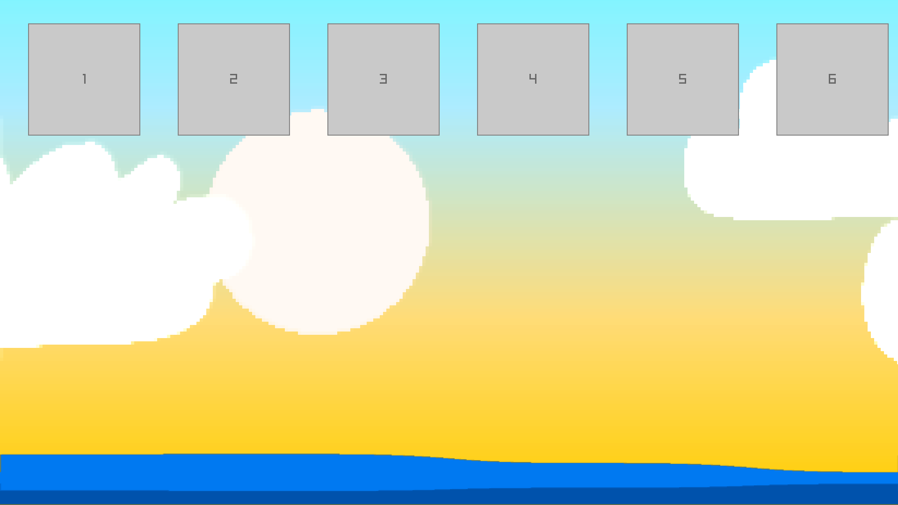
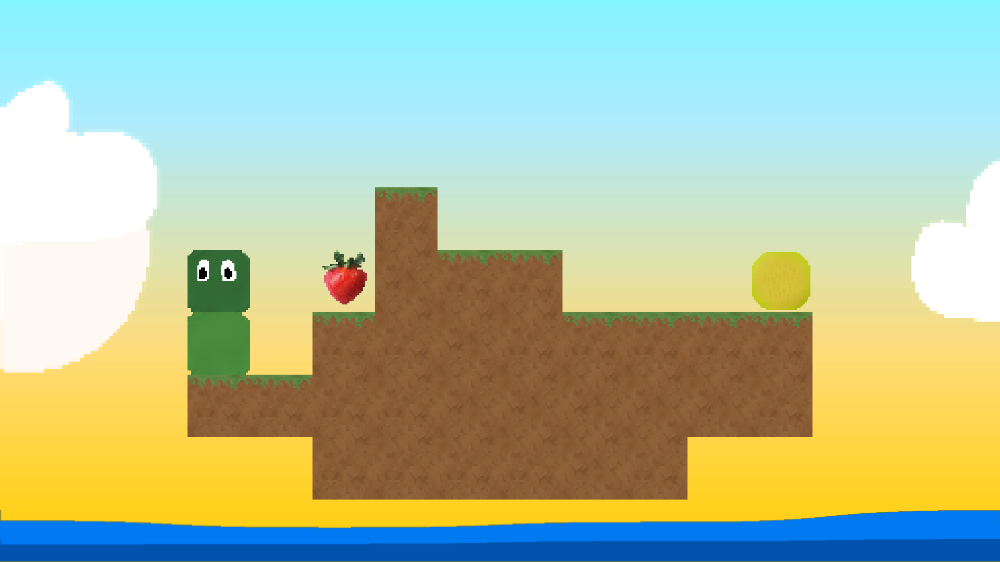

# Raybird

## Credits

Credit to [RayLib](https://github.com/raysan5/raylib) for the library and to [raylib-zig](https://github.com/Not-Nik/raylib-zig) for the Zig bindings.  
Thank you to [Snake Bird](https://store.steampowered.com/app/357300/Snakebird/) for being such a fun game.

## Building

1. Install zig 0.13, newer versions do not work.
2. Initialize a project using raylib-zig.
3. Clone this project into the folder, replacing any old files.
4. While in the project directory run `zig build run`.

## TODO

* Dynamic Backgrounds
* Multiple Playable Snakes
* Updated Snake Graphics
* Pushable Objects
* Portals
* New UI
* Resolution Changing

## The Game

### Level Editor

### Level Select

### In Game

